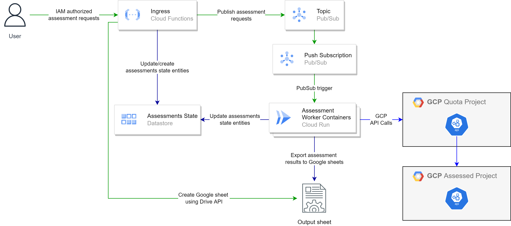

# Cloud Wellness Assessment Automation

This cloud native solution is designed for Cloud Wellness Assessment Automation



## Information flow

1. User sends request for wellness assessment of a GCP project. The request is sent to ingress cloudfunction URL and only authenticated requests must be allowed on the cloudfunction. Sample request using curl is shown below:
```bash
curl -m 70 -X POST {CLOUDFUNCTION_URL} -H "Authorization:bearer $(gcloud auth print-identity-token)" -H "Content-Type:application/json" -d '{
    "project_id": "{ASSESSED_PROJECT_ID}",
    "parent_folder": "{GDRIVE_PARENT_FOLDER}",
    "client": "{CLIENT_NAME}"
}'
```

2. Cloud function processes the request and publish assessments list to PubSub topic. Here for each GCP project different assessment areas are published separately and each published message is processed by single Cloud Run instance. This parallelizes the process and decreases the assessment time and decreases memory utilzation on single Cloud Run instance. The function also creates Google sheet using Drive API which is later used by Cloud Run instances for export and the function cofigures assessment state in Cloud Datastore. Currently following areas are published for assessment:
	1. IAM
	2. Compute Engine
	3. Kubernetes Engine
	4. Compute Network
	5. Database
	6. Cost Optimization

3. Push type Pub/Sub topic associated with the Pub/Sub topic triggers Cloud Run instances and each Cloud Run instance assess one assessment area for the GCP project. The assessment results are exported to the Google sheet. Also assessment state is maintained in Cloud Datastore.